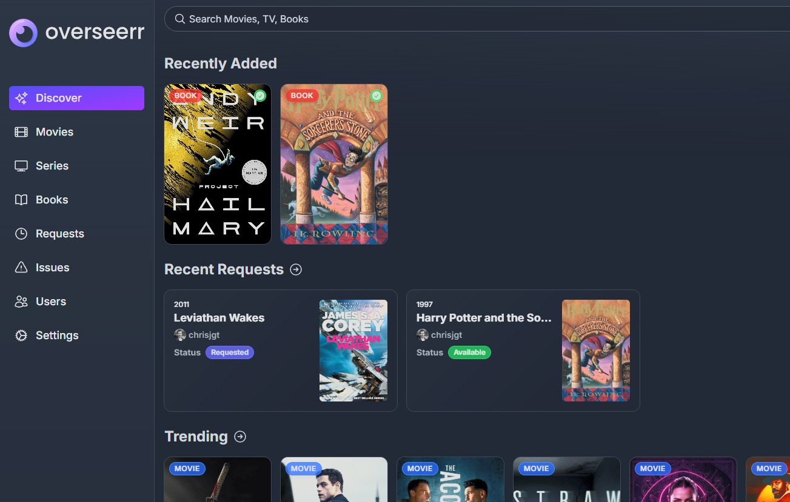
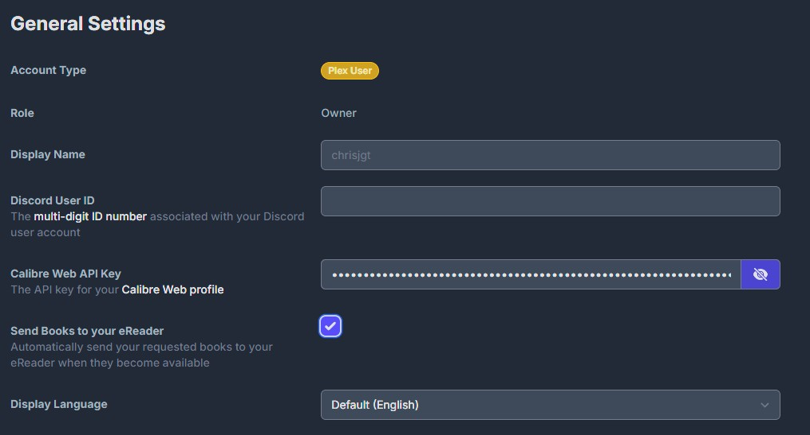
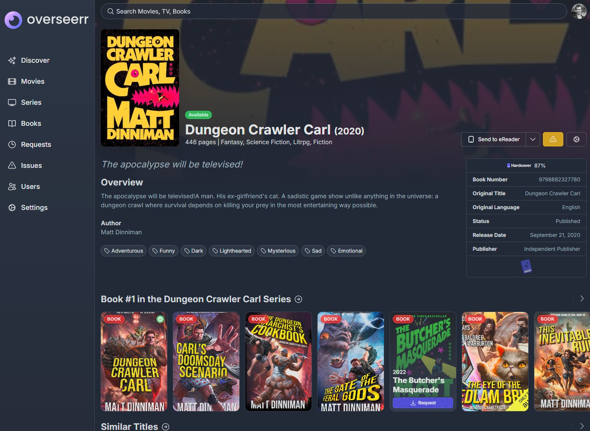
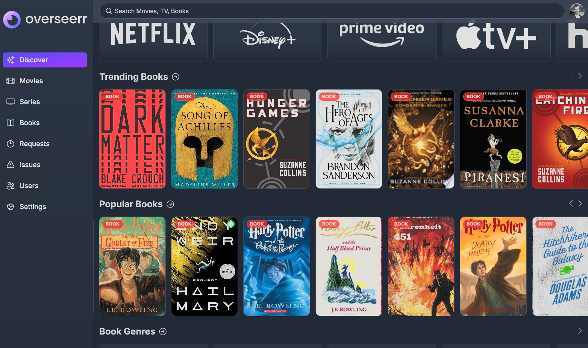

# Overseerr for eBooks

All the features of Overseerr, plus added support for requesting eBooks using [Hardcover](https://hardcover.app) metadata.

> [!IMPORTANT]
> If you are not interesting in eBook support or are looking for the original project behind this, visit [Overseerr](https://github.com/sct/overseerr).

> [!WARNING]
> Use with care. Support the works of authors you've enjoyed by purchasing their books. Let this be a tool to discover books you might not have otherwise. Authors are directly affected by illegitimate distribution of their works online.

## Current features

- Integrates with [Calibre Web](https://github.com/janeczku/calibre-web) ([Automated](https://github.com/crocodilestick/Calibre-Web-Automated))
- Includes Calibre Web library scanning to keep track of the titles which are already available:

  

- Can automatically send books to your eReader via Calibre Web, once they become available:

  

- Detailed information for each book via [Hardcover](https://hardcover.app) metadata:

  

- Find trending and popular books from the Discover page:

  

- And all the features of the original Overseerr included.
  <!-- markdownlint-restore -->
  <!-- prettier-ignore-end -->
